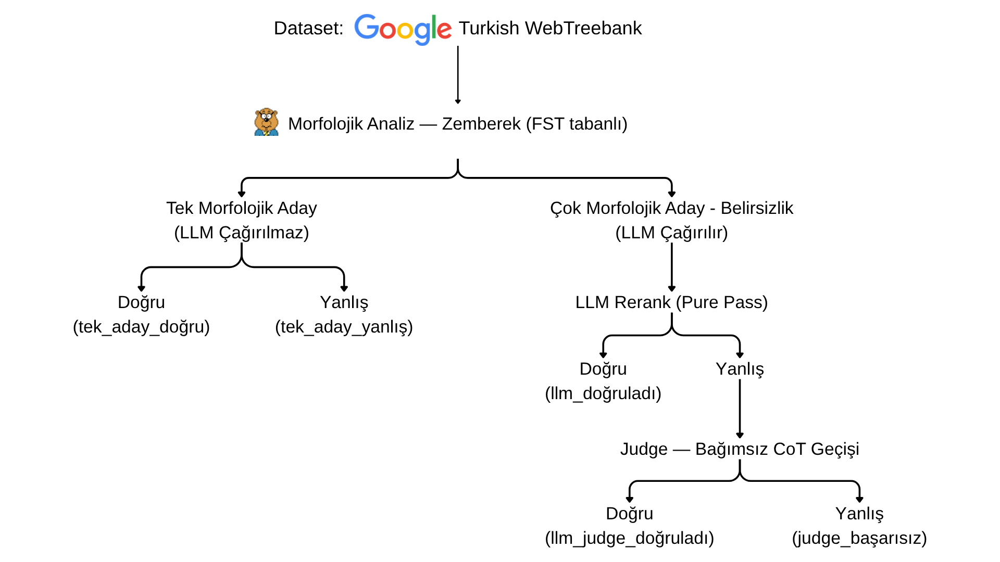

# Zemberek LLM Reranker

LLM destekli Türkçe morfolojik belirsizlik giderme (morphological disambiguation) aracı.

---

## Neden bu proje?

Türkçe, aglütinatif yapısı nedeniyle bir kelimenin onlarca farklı analizi olabilir. Hangi analizin doğru olduğu yalnızca bağlam incelenerek anlaşılabilir.

```
"koyun" →  [koyun:Noun]  koyun:Noun+A3sg        → koyun (hayvan)
           [koy:Noun]    koy:Noun+A3sg+un:Gen    → koyun (koyun-un, tamlayan)
           [koymak:Verb] koy:Verb+Imp+un:A2pl    → koyun (emir: koyunuz)
```

**Zemberek** tüm olası analizleri üretir. Bu proje, doğru analizin hangisi olduğuna **LLM'in bağlam anlayışını** kullanarak karar verir.

---

## Proje Akışı

```
Wikipedia URL listesi (source.txt)
        │
        ▼
  Wikipedia Scraper          (scrapWikipedia.py)
        │  — Makale metni çeker
        ▼
  Paragraph Chunker          (LLMBaseRanking/chunker.py)
        │  — Metni cümle / paragraf parçalarına böler
        ▼
  Zemberek Java Gateway      (Zemberek Morfoloji/)
        │  — Her kelime için N aday morfolojik analiz üretir
        │  — py4j köprüsü üzerinden Python'a iletir
        ▼
  LLM Ranker                 (LLMBaseRanking/ranker.py)
        │  — Aday analizleri cümle bağlamıyla birlikte LLM'e gönderir
        │  — LLM her kelime için doğru indeksi JSON olarak döndürür
        │
        ├─► [isteğe bağlı] LLM-as-Judge (CoT ikinci geçiş)
        │     — İlk seçimi bağımsız olarak yeniden değerlendirir
        │     — Gramer rolünü (özne/nesne/yüklem) analiz eder
        │
        ▼
  Disambiguation çıktısı
        — Her kelime için seçilen morfolojik analiz
```

### İki Çalışma Modu

| Mod | Açıklama |
|-----|----------|
| **Pure LLM** | Tek geçişte tüm belirsiz kelimeleri çözer |
| **LLM + Judge** | İlk seçimi CoT (chain-of-thought) ile ikinci bir LLM geçişiyle doğrular |

---

## Kurulum

### Gereksinimler

- Python 3.9+
- Java 17+
- OpenAI-uyumlu herhangi bir LLM API'si (Ollama, OpenRouter, vb.)

### Paketler

```bash
pip install openai py4j python-dotenv beautifulsoup4 requests
```

### `.env` Dosyası

```bash
cp LLMBaseRanking/.env.example LLMBaseRanking/.env
```

`LLMBaseRanking/.env` dosyasını aşağıdaki şablonlardan biriyle doldurun:

```env
# Ollama (yerel)
LLM_BASE_URL=http://localhost:11434/v1
LLM_MODEL=gemma3:27b
LLM_API_KEY=ollama

# OpenRouter
LLM_BASE_URL=https://openrouter.ai/api/v1
LLM_MODEL=anthropic/claude-3-5-sonnet
LLM_API_KEY=sk-or-...

# OpenAI
LLM_BASE_URL=https://api.openai.com/v1
LLM_MODEL=gpt-4o
LLM_API_KEY=sk-...
```

---

## Çalıştırma

### Metin Analizi (Ana Kullanım)

**1.** `source.txt` dosyasına Wikipedia URL'lerini ekleyin:

```
https://tr.wikipedia.org/wiki/Aziz_Sancar
https://tr.wikipedia.org/wiki/Atatürk
```

**2.** Tek komutla çalıştırın:

```bash
./run.sh
```

> `run.sh`, Java gateway'i derler, başlatır ve Python analiz motorunu çalıştırır.  
> İşlem bitince gateway otomatik kapatılır.

İsteğe bağlı argümanlar:

```bash
./run.sh source.txt paragraph   # kaynak ve chunk stratejisi
./run.sh source.txt sentence    # cümle bazlı chunk (varsayılan)
```

### Örnek Çıktı

```
Paragraph 1: Koyun otluyordu.

  koyun:
      [0] [koymak:Verb] koy:Verb+Imp+un:A2pl
      [1] [koy:Noun]    koy:Noun+A3sg+un:Gen
    → [2] [koyun:Noun]  koyun:Noun+A3sg         ✓ LLM seçimi
```

---

## Benchmark

Sistem, Google **Turkish Web Treebank (TWT)** veri setiyle değerlendirilir.  
TWT, insan-anotasyonlu CoNLL-U formatında Türkçe cümleler içerir — ve diğer Türkçe ağaçbankalarından
(UD treebank'ları, TrMor2018 vb.) farklı olarak, kelimeleri gerçek **yüzey ek/kök** seviyesinde
böler (soyut gramer etiketi değil). Bu yüzden surface-segmentasyon benchmark'ı için kullanılabilen
nadir/tek Türkçe kaynak budur.

### Değerlendirme Yöntemi

- Sadece **birden fazla Zemberek adayı olan kelimeler** değerlendirilir (gerçek belirsizlik)
- Baseline: Zemberek'in ilk adayı (kural-tabanlı)
- LLM: Bu projenin seçimi
- Karşılaştırma: Seçilen morfem dizisi, TWT'nin gold morfem dizisiyle eşleşiyor mu?

### Akış

Judge, **sadece** Pure LLM'in (TWT gold'una göre) yanlış seçtiği belirsiz kelimelere gönderilir;
doğru seçilen kelimeler judge'a hiç gitmeden "doğru" işaretli kalır. Tek adaylı kelimeler ise
LLM'e hiç gönderilmez — Zemberek'in tek seçeneği ne ise odur, doğru/yanlış olması fark etmez.



Her kelime, `benchmark_logs/*.jsonl` log'unda şu sekiz etiketten (`label` alanı) birini alır:

| Etiket | Anlamı |
|---|---|
| `tek_aday_dogru` | Zemberek'te tek aday var, gold'a uyuyor (LLM çağrılmadı) |
| `tek_aday_yanlis` | Zemberek'te tek aday var, gold'a uymuyor (düzeltilecek başka aday yok) |
| `llm_dogruladi` | LLM (judge'sız) gold'a göre doğru seçti |
| `llm_judge_dogruladi` | LLM yanlıştı, judge'a gitti, judge doğru seçti |
| `judge_basarisiz` | LLM yanlıştı, judge'a gitti, judge da düzeltemedi — **ama doğru aday adaylar arasında vardı** (gerçek, düzeltilebilir hata) |
| `zemberek_kapsam_disi` | LLM yanlıştı, judge'a gitti, judge da düzeltemedi — **gold'a uyan tek bir aday Zemberek'in ürettiği listede hiç yok** (kazanılamaz; bkz. aşağıdaki not) |
| `llm_yanlis` | LLM yanlış ama `--judge` kapalı olduğu için hiç denenmedi |
| `analiz_yok` | Zemberek hiç aday üretemedi |
| `tek_ig_atlandi` | Gold tarafı tek-IG, değerlendirme dışı |

`judge_basarisiz` durumunda, LLM ve Judge'ın **bağımsız olarak aynı (gold'dan farklı) analizde**
buluşup buluşmadığını gösteren bir `note` alanı da eklenir — bu uzlaşma, seçimin gold'a göre
"yanlış" olsa da dilbilimsel olarak savunulabilir bir alternatif olma ihtimaline işaret eder.

#### Önemli bulgu: hataların ~%63'ü Zemberek kapsam eksikliği, model hatası değil

Judge'ın düzeltemediği kelimelerin gerçek koşuda incelenmesi şunu gösterdi: bu kelimelerin
**%63'ünde Zemberek'in ürettiği aday listesinde gold'a uyan tek bir seçenek bile yok** —
yani hiçbir LLM/Judge stratejisi bu kelimeleri doğru bulamaz, çünkü doğru cevap hiç sunulmuyor.

Sebep, Zemberek'in bazı `-la/-le` türetilmiş fiilleri **kendi sözlüğünde atomik kök** olarak
tutması (örn. `açıklamak`, `anlaşmak`, `yorumlamak`, `zayıflamak`, `kesişmek`), TWT'nin ise
her zaman en derin türetme sınırına kadar bölmesi (`açık+la`, `anla+ş`, `yorum+la`, `zayıf+la`,
`kes+iş`):

```
açıklayıcı   gold: açık+la+yıcı     Zemberek'in TÜM adayları: açıkla+yıcı   (açık+la hiç yok)
anlaşma      gold: anla+ş+ma        Zemberek'in TÜM adayları: anlaş+ma     (anla+ş hiç yok)
ZAYIFLAMA    gold: zayıf+la+ma      Zemberek'in TÜM adayları: zayıfla+ma   (zayıf+la hiç yok)
```

Bu, LLM rerank yaklaşımının değil, **Zemberek'in morfotaktik kapsamının** bir sınırı —
benchmark'taki gerçek/düzeltilebilir hata oranı `judge_basarisiz` sayısıyla, kazanılamaz
oran ise `zemberek_kapsam_disi` sayısıyla takip edilmelidir.

### Benchmark'ı Çalıştırma

```bash
./benchmark.sh
```

> Veri seti yoksa otomatik indirilir, gateway başlatılır, benchmark çalışır.

Ek seçenekler:

```bash
# Adım adım canlı çıktı
./benchmark.sh --step

# Yalnızca yanlış tahminleri göster
./benchmark.sh --verbose

# LLM-as-Judge ikinci geçişini etkinleştir
./benchmark.sh --judge

# İlk N cümleyle sınırla (hızlı test)
./benchmark.sh --limit 100

# Karar logunu farklı dosyaya yaz
./benchmark.sh --json-log benchmark_logs/my_run.jsonl
```

### Benchmark Çıktısı

Aşağıdaki rakamlar `google/gemma-4-31b-it` ile, `--judge` etkin, TWT'nin tamamı (4.851 cümle,
web + wiki) üzerinde yapılan tam bir koşunun gerçek sonuçlarıdır:

| | web.conllu | wiki.conllu | **Toplam** |
|---|---|---|---|
| Toplam kelime | 4.522 | 6.886 | **11.408** |
| Belirsiz (LLM gerekli) | 2.745 | 4.334 | **7.079** |
| Tek adaylı | 1.777 (%88.2 doğru) | 2.552 (%86.6 doğru) | 4.329 (%87.2 doğru) |

**Disambiguation accuracy (belirsiz kelimeler):**

| | web | wiki | **Toplam** |
|---|---|---|---|
| Baseline | 1545/2745 = %56.3 | 2487/4334 = %57.4 | 4032/7079 = **%57.0** |
| Pure LLM | 2200/2745 = %80.1 (+23.9) | 3593/4334 = %82.9 (+25.5) | 5793/7079 = **%81.8** (+24.9) |
| LLM + Judge | 2229/2745 = %81.2 (+24.9 / +1.1 vs pure) | 3632/4334 = %83.8 (+26.4 / +0.9 vs pure) | 5861/7079 = **%82.8** (+25.8 / +1.0 vs pure) |

**Genel doğruluk:** Pure LLM = 9569/11408 = **%83.9**, +Judge = 9637/11408 = **%84.5**

**Kazanılamaz oran** (`zemberek_kapsam_disi` / (`zemberek_kapsam_disi` + `judge_basarisiz`)): 773/1218 = **%63.5** — judge'ın "düzeltemediği" durumların üçte ikisinde doğru cevap zaten Zemberek'in aday listesinde yoktu (yukarıdaki bulguya bakınız).

Karar detayları `benchmark_logs/twt_benchmark.jsonl` dosyasına JSONL formatında yazılır.  
Her satır bir cümleyi; her cümle içindeki her token için baseline, LLM ve judge seçimlerini,
ayrıca yukarıdaki `label` ve `note` alanlarını içerir.

### Yanlışların İkinci Kez Denetlenmesi (opsiyonel, ayrı araç)

Benchmark'ın "yanlış" saydığı tahminlerin bir kısmı, gold'dan farklı ama dilbilimsel olarak
kabul edilebilir alternatif analizler olabilir. Bunu sorgulamak için ayrı, elle çalıştırılan
iki script var — benchmark'ın bir parçası değil, sonradan isteğe bağlı çalıştırılır:

```bash
# 1. twt_benchmark.jsonl'den yanlışları çek
python benchmark_logs/extract_wrong.py

# 2. 5 farklı LLM hakemine sor, çoğunluk oyuyla karar ver
python benchmark_logs/llm_jury.py
```

`llm_jury.py`, ana sistemin Pure/Judge geçişlerinden **tamamen bağımsız** 5 modeli (varsayılan:
Claude Haiku, Gemini Flash, Llama 3.3, Mistral Small, GPT-4o-mini — `.env` ile değiştirilebilir)
paralel sorgular, checkpoint/resume destekler, sonucu `jury_results.json`'a yazar.

---

## Proje Yapısı

```
.
├── run.sh                        ← Ana çalıştırma betiği (derle + gateway + analiz)
├── benchmark.sh                  ← Benchmark betiği (derle + gateway + TWT değerlendirmesi)
├── source.txt                    ← Analiz edilecek Wikipedia URL listesi
├── scrapWikipedia.py             ← Wikipedia makale scraper'ı
│
├── Zemberek Morfoloji/           ← Java katmanı
│   ├── java_gateway/
│   │   └── ZemberekGateway.java  ← py4j köprüsü, Zemberek'i Python'a açar
│   ├── lib/
│   │   └── zemberek-full.jar     ← Zemberek NLP kütüphanesi
│   └── start_zemberek_gateway.sh ← Gateway'i ayrıca başlatmak için
│
├── LLMBaseRanking/               ← Python analiz motoru
│   ├── main.py                   ← Giriş noktası
│   ├── ranker.py                 ← LLM prompt + JSON parse + yeniden sıralama
│   ├── chunker.py                ← Metin parçalama stratejileri
│   ├── zemberek_client.py        ← py4j üzerinden Zemberek istemcisi
│   └── config.py                 ← .env okuyucu
│
├── Benchmark/                    ← Değerlendirme modülü
│   ├── benchmark.py              ← TWT CoNLL-U değerlendirme motoru
│   ├── dataset_loader.py         ← CoNLL-U dosya okuyucu
│   └── morpheme_normalizer.py    ← Morfem string normalleştirici
│
└── benchmark_logs/
    ├── twt_benchmark.jsonl       ← Benchmark karar logu (JSONL, koşu sonrası oluşur)
    ├── extract_wrong.py          ← JSONL'den yanlış tahminleri çeker
    └── llm_jury.py               ← 5 modelli bağımsız ikinci denetim (opsiyonel)
```

---

## Referanslar

**[Zemberek NLP](https://github.com/ahmetaa/zemberek-nlp)** — Ahmet Afşın Akın tarafından geliştirilen açık kaynaklı Türkçe NLP kütüphanesi. Bu proje, morfolojik aday üretimi için Zemberek'in `TurkishMorphology` modülünü kullanmaktadır.

**[Google Turkish Web Treebank](https://github.com/google-research-datasets/turkish-treebanks)** — Google tarafından yayımlanan, insan-anotasyonlu Türkçe bağımlılık ağacı bankası. Benchmark değerlendirmesinde kullanılmaktadır.

**[Wikipedia TR](https://tr.wikipedia.org)** — Kaynak metin olarak Türkçe Wikipedia makaleleri kullanılmaktadır. İçerik [CC BY-SA 4.0](https://creativecommons.org/licenses/by-sa/4.0/) lisansı altındadır.
